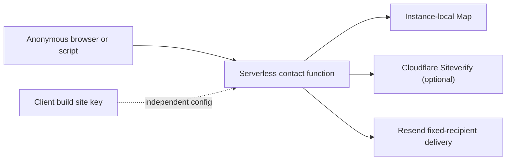
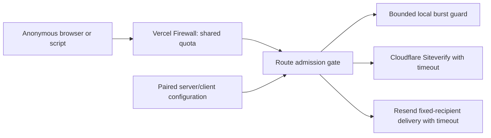
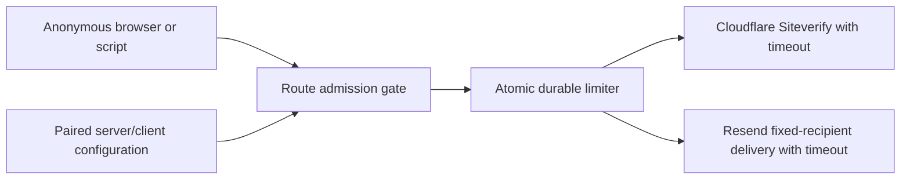

# Security Hardening Proposal: Own contact admission at one boundary

## Decision

Choose where each contact-control invariant lives. The route can cheaply decide request authority, input bounds, configuration validity, and provider deadlines. It cannot make process memory globally authoritative across serverless instances. We therefore need a deliberate split between local admission and the global quota.

## Executive Recommendation

Option 1, **Layered route admission plus Vercel Firewall**, keeps the current architecture and makes the route's admission phase explicit, while the hosting edge owns the global rate limit. Option 2, **Atomic durable application limiter**, gives the application portable quota ownership through a managed store.

I recommend Option 1 under the current constraints. It is the smallest design that restores each invariant without adding a new network dependency to a low-volume form. Option 2 should win if the application later needs identity-aware quotas, portability beyond Vercel, or richer shared abuse state.

## Evidence

| Evidence | Finding | What it establishes |
|---|---|---|
| `csf_01ea5c2e6d7db208dee30851` | [Partial Turnstile configuration fails open](../../findings/turnstile-partial-configuration-fails-open/turnstile-partial-configuration-fails-open.md) | Optional verification is inferred inconsistently from separate client/server variables. |
| `csf_58b9e306475dbc4e960d52b6` | [Instance-local contact rate limit can be bypassed](../../findings/instance-local-rate-limit-bypass/instance-local-rate-limit-bypass.md) | A global quota is incorrectly assigned to an ephemeral module-level Map. |
| `csf_7cb0e20f1567ff16a4200816` | [Cross-origin text/plain requests can submit](../../findings/cross-origin-contact-submission/cross-origin-contact-submission.md) | Request authority and media type are not checked before parsing and delivery. |

I inspected the route, the client submission code, the deployment model, and each safe local probe. The observed facts are the missing checks and state lifetimes above. The inferred structural condition is that admission policy has no single owner: it is distributed across client build configuration, route branches, process memory, and implicit browser behavior.

## Current Design And Failure Mode

An anonymous request enters one serverless function instance. That instance consumes a local Map allowance before validating the body, treats an absent Turnstile secret as successful verification, and sends through Resend after schema validation. The browser is expected—but not required—to use JSON and the site origin.

This structure creates two kinds of drift. Local drift occurs when one route forgets a media-type/origin gate or when client and server configuration disagree. Lifetime drift occurs when a global promise—five requests per IP per hour—is implemented in state whose lifetime is one warm JavaScript instance. The source supports both observations directly; no architectural rewrite is needed to see that the controls have different natural owners.

## Desired Invariants

- Every browser submission is trusted-origin `application/json` before body parsing.
- Turnstile is deliberately disabled or fully paired; partial configuration and provider failure never authorize delivery.
- Body bytes, local key cardinality, and upstream waits are bounded.
- Every production instance observes one authoritative per-client submission budget.
- Rejection paths do not call Cloudflare or Resend and return non-cacheable generic errors.

## Constraints And Non-Goals

The visible UI, animation timing, form fields, valid request contract, static-first rendering, and fixed recipient must remain unchanged. This proposal does not add user accounts, a general anti-abuse platform, or a new paid service by default. IP limits are a coarse abuse control, not identity or fraud prevention.

## Before Architecture

The current boundary is shown in [the before diagram](../diagrams/contact-admission-boundary-before.mmd). The important edge is that the function instance owns both the local request decisions and a quota that is intended to be global.

## Options

### Option 1: Layered route admission plus Vercel Firewall

We keep the existing function, but give it one ordered admission pipeline: media type and origin, declared and actual byte bounds, schema and honeypot, bounded local burst guard, paired Turnstile configuration, then provider calls with deadlines. An edge rule scoped to `POST /api/contact` becomes the authoritative shared rate limit.

The attractive part is that cheap rejections occur before parsing and function work, while legitimate submissions follow the same UI and delivery path. The code remains easy to test locally. What gives me pause is operational: the rate-limit finding is not truly closed until the edge rule is verified from production configuration. Documentation and post-deployment read-back are therefore part of the control, not optional prose.

[After diagram](../diagrams/contact-admission-boundary-layered-route-and-edge-after.mmd):

| Change | Before | After | Security consequence | Cost |
|---|---|---|---|---|
| Request authority | Implicit browser behavior | Explicit origin + JSON checks | Closes cross-origin simple-request path | Constant header comparisons |
| Turnstile mode | Missing secret means success | Paired configuration, fail closed | Closes partial-config bypass | One configuration branch |
| Global quota | Instance-local Map | Edge rule | Shared enforcement before function | Dashboard ownership and monitoring |
| Resource bounds | Platform defaults | App bounds, Map cap, deadlines | Predictable memory and wait limits | Small maintenance surface |

Rollback is straightforward: revert the route/config change and disable the edge rule if legitimate traffic is rejected. Because the UI contract is unchanged, no content migration is required.

### Option 2: Atomic durable application limiter

We retain the same local admission pipeline but replace quota authority with an atomic fixed- or sliding-window operation in a managed durable store. This is the strongest option when application-owned policy matters: every instance calls one logical counter, and the abstraction can evolve toward identities or richer rules.

Its security case is solid, but the cost mechanism is also clear. Every candidate request gains a network dependency, credential, quota, and failure mode. We must decide whether store failure closes the nonessential form or activates a tighter emergency policy, then test that choice. A feature flag and the edge rule should remain during migration so rollback does not reopen abuse.

[After diagram](../diagrams/contact-admission-boundary-durable-application-limiter-after.mmd):

| Change | Before | After | Security consequence | Cost |
|---|---|---|---|---|
| Quota state | Per process | Atomic shared store | Global invariant is application-owned | Network hop and provider dependency |
| Failure policy | Implicit reset | Explicit fail-closed/degraded mode | Predictable abuse behavior | Reliability design and tests |
| Operations | No limiter service | Credentials, TTLs, monitoring | Auditable state | Cost and incident surface |

This option is reversible behind a feature flag, provided the edge rule remains active during rollback. It should not be introduced casually only to avoid one dashboard control.

## Comparison

| Dimension | Option 1: Route + edge | Option 2: Durable limiter |
|---|---|---|
| Security | Strong for current path; edge config must be verified | Strong and application-owned; new credential boundary |
| Performance | Early edge rejects; no added accepted-path store hop | Added limiter round trip |
| Memory | Bounded local Map | Bounded local memory; external retained keys |
| Reliability | Provider timeouts; no new application dependency | Limiter availability and failure policy added |
| Operability | Vercel rule plus runbook | New service, secrets, alerts, quota, cost |
| Migration | Focused and reversible | Feature flag, provisioning, canary, fault tests |

The comparison favors Option 1 because this is a static portfolio with one fixed-recipient endpoint. The result changes if application portability or identity-aware policy becomes a higher priority than minimal latency and operational surface.

## Recommendation

I recommend Option 1 and would be comfortable shipping it once the route tests pass and the production firewall rule is read back. We should be honest that repository code alone cannot prove the cross-instance budget. If the hosting edge cannot provide the needed rule without unacceptable cost or policy limits, Option 2 becomes the correct next design rather than pretending the Map is sufficient.

## Evidence Coverage And Residual Risk

| Evidence | Option 1 effect | Option 2 effect | Residual risk |
|---|---|---|---|
| `csf_01ea5c2e6d7db208dee30851` — Turnstile partial configuration | Addresses | Addresses | Both require the local paired-config patch. |
| `csf_58b9e306475dbc4e960d52b6` — Instance-local rate limit | Addresses when edge rule is verified | Addresses with atomic store | IP identity remains coarse; distributed clients retain separate budgets. |
| `csf_7cb0e20f1567ff16a4200816` — Cross-origin contact submission | Addresses | Addresses | Non-browser scripts can still call the intentionally public API within abuse controls. |

A restrictive CSP, HSTS, MIME protections, no-store API responses, and immutable asset caching are useful adjacent controls but do not substitute for the four admission invariants.

## Migration And Rollout

Implement the local admission pipeline and regression tests first. Deploy it with the existing in-memory guard bounded and clearly labeled secondary. Verify legitimate same-origin contact behavior, then enable or inspect the path-specific edge rule and record its threshold and scope in the deployment checklist. Roll back the edge rule independently if it blocks legitimate traffic; the local origin, configuration, size, and timeout fixes should remain.

## Validation Plan

- Re-run all three safe local PoCs against the fixed route or repaired model.
- Unit-test configuration matrices, origin/media-type gates, byte bounds, limiter cleanup/cap, and provider timeouts.
- Build, lint, type-check, and run the browser contact flow.
- Compare settled before/after screenshots and Lighthouse metrics.
- Inspect production headers and rejection responses.
- Read back the Vercel Firewall rule; until then, record the global rate limit as an operational follow-up.

## Implementation Work Packages

- Create a small testable contact-admission module with explicit constants and result types.
- Reorder the route so cheap authority and size checks precede parsing and external calls.
- Bound the local burst guard and all provider waits; standardize no-store responses.
- Add security headers and cache policy without changing render behavior.
- Add focused tests and deployment documentation, including edge-rule verification and rollback.

## Open Questions

- Does the current Vercel plan expose a non-billable path-specific rate-limit rule with the desired threshold?
- Should a future custom domain replace the current canonical alias in the origin allowlist?
- At what traffic level would a durable application limiter's portability justify its added latency and operations?

