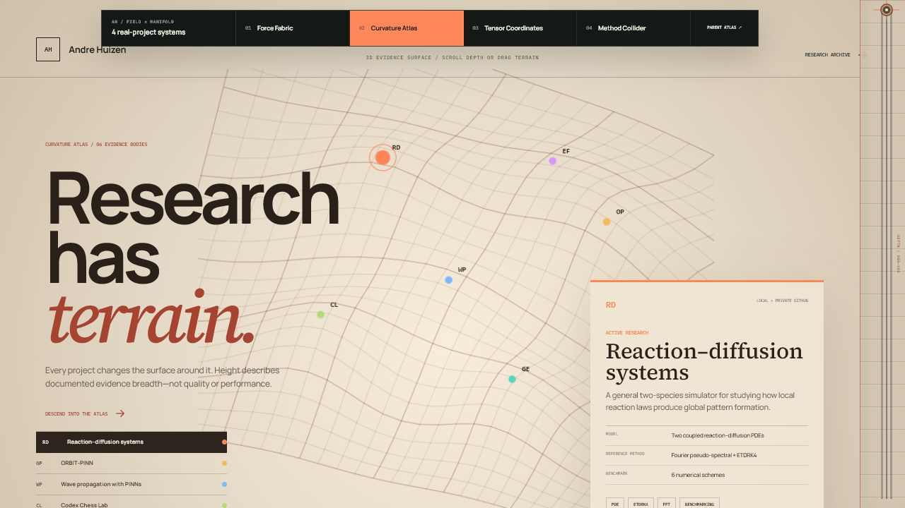
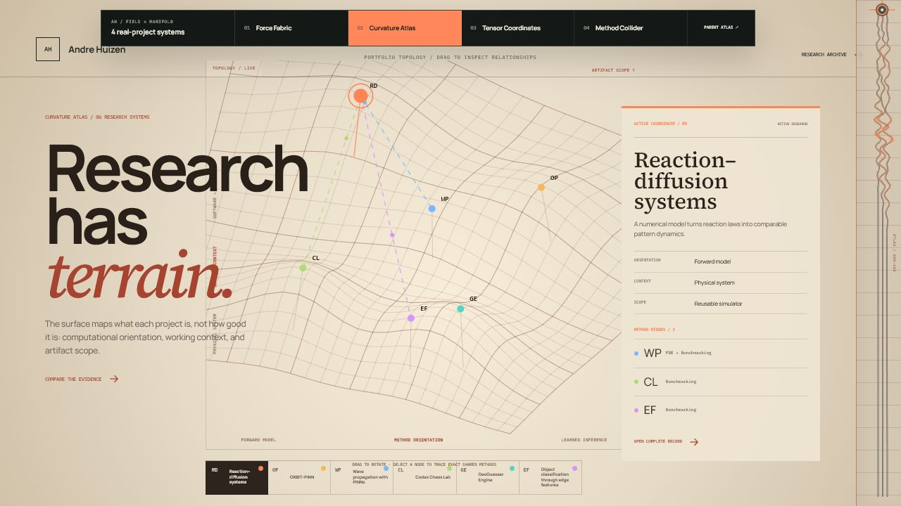
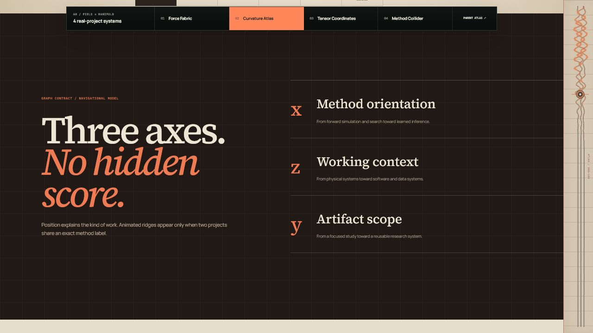
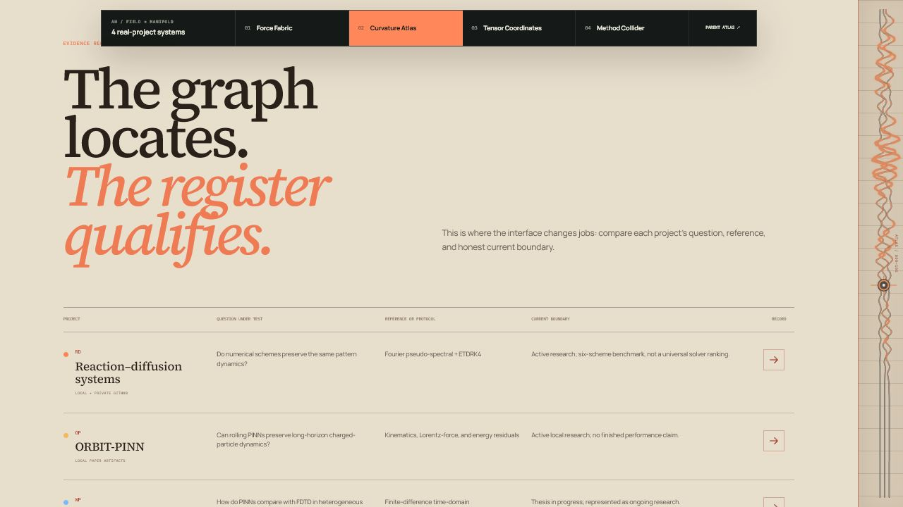

# Curvature Atlas intent audit

## Audit scope

Surface: `/prototypes/field-manifold/curvature-atlas` at 1280 × 720, with a responsive verification pass at 390 × 844.

User goal: understand how the projects relate, then judge what evidence supports each project without repeating the same selection flow twice.

## 1. Original graph and evidence-depth flow

Health: needs structural correction.

- Strength: the warm terrain, project peaks, and measurement rail establish a distinctive research-atlas identity.
- UX risk: the hero graph and evidence-depth section both select one project and restate the same project record. The second interaction changes presentation, not purpose.
- Accessibility risk: the canvas needs an equivalent control surface; the project buttons provide one, but the repeated scroll-selection model makes state changes harder to interpret.

## 2. Revised topology workspace

Health: strong.

- The graph now answers one specific question: where does each project sit by method orientation, working context, and artifact scope?
- Selecting a project exposes its coordinate rationale. Animated ridges represent exact shared method labels and can be followed through accessible buttons.
- The four-project selector remains the keyboard and touch equivalent of selecting a canvas node.

## 3. Graph contract

Health: strong.

- The three axes are defined outside the visual, which prevents the terrain from implying an unexplained quality ranking.
- “No hidden score” is a direct trust statement and makes the abstraction legible before evidence is compared.

## 4. Evidence register

Health: strong.

- The register performs a different job from the graph: it compares the question under test, reference or protocol, source, and current boundary.
- Native table semantics support desktop comparison. Mobile converts each row into a labeled record without horizontal overflow.

## Evidence limits

- Screenshots support hierarchy, layout, and visible-state findings but cannot prove complete WCAG conformance.
- Browser checks confirmed semantic headings, table roles, pressed state, project-selection updates, desktop custom-scrollbar geometry, reduced horizontal overflow, and no console warnings or errors.
- Screen-reader narration, forced-colors behavior, and 200% zoom still require dedicated assistive-technology testing.
